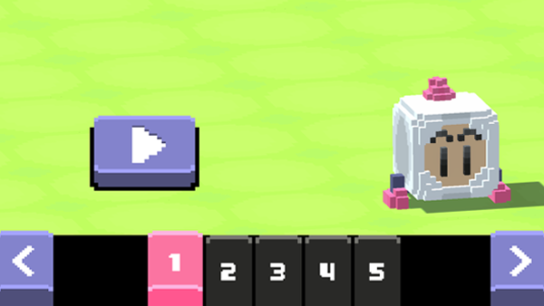

# Bomberman-Like

**Brief description:** A 3D game in the style of Bomberman, where the player, moving through available cells, must reach the opposite end of the level, laying a path using bombs and avoiding contact with enemies.

## Description

The repository contains an educational project "Bomberman-Like" developed as part of university practice. The game is a 3D interpretation of the classic Bomberman game, where the player must reach the opposite end of the level, avoiding encounters with enemies and using bombs to pave the way.

## Features

- Voxel graphics
- Grid-based movement

## Technologies

- Unity 3D
- C#
- URP Renderer
- Cinemachine
- DOTween
- MagicVoxel and Blender for models
- Photoshop for UI elements
- Figma for levels prototype

## Demonstration

## Where to play

The game is available to play in the browser via a link on [itch.io](link).

## How to play

Use the WASD keys to control the character for movement, Space to place bombs, and R for quick level restart.
